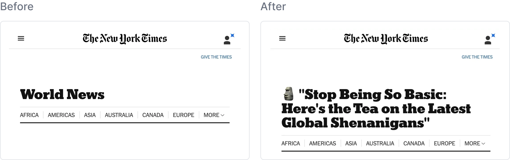

# Reductress Headlines Chrome Extension
This Chrome extension rewrites news headlines in a sassy, satirical style using OpenAI's GPT-3.5-turbo. It works on any news website or blog post by transforming the title with a single click on the extension icon. This was initially written for April Fools 2023.

The headlines are rewritten in the style of the [Reductress](https://reductress.com/), which is a satirical women’s magazine with the mission to “take on the outdated perspectives and condescending tone of popular women’s media.”

The Chrome extension was entirely written by GPT-4, but I share the code in this repository. The code came about in an interative process/conversation with GPT-4. The process is detailed in the following article: [How I transformed every news headline into a satire for April Fools](https://blog.yenniejun.com/p/how-i-transformed-every-news-headline).

Example of before and after of NYT "World News" page:


View a [short demo on YouTube](https://www.youtube.com/watch?v=7mnq4YiKnnc&feature=youtu.be&ab_channel=YennieJun).

### How to run
1. Clone this repo.
2. Create a config file (`config.js`) and replace "<YOUR API KEY>" with your [OpenAI API key](https://platform.openai.com/account/api-keys).
   ```
const CONFIG = {
  OPENAI_API_KEY: "<YOUR API KEY>"
};

export default CONFIG;
```

3. Open Chrome and navigate to chrome://extensions/.
4. Enable "Developer mode" by toggling the switch in the top-right corner.
5. Click "Load unpacked" and select the directory containing the cloned repository.

The extension is now installed and ready to use.


### Usage
1. Visit any news website or blog post with a headline.
2. Click on the Chrome extension icon in the top-right corner of your browser.
3. The headline will be transformed into a sassy, satirical version.
4. Click the extension icon again to revert the headline back to its original form.

Enjoy reading news articles with a twist!


